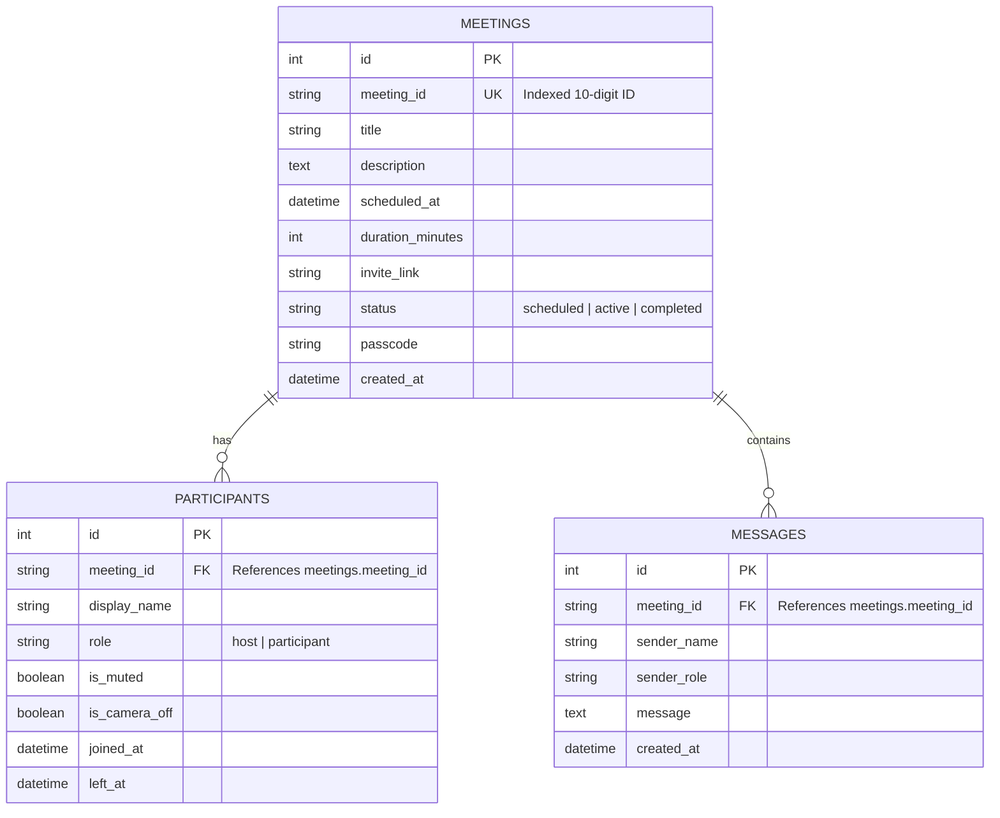

# MeetSpace — Production-Grade Zoom Clone (SDE Fullstack Assignment)

> A modern, responsive video-conferencing web application built with **Next.js (React 19 + TypeScript + Tailwind CSS)** and **Python (FastAPI + SQLAlchemy + SQLite)**. Inspired by Zoom's web interface, MeetSpace replicates core conferencing workflows including instant meeting creation, persistent scheduling, interactive meeting rooms with simulated and real WebRTC-ready media, in-meeting live chat, and participant moderation.

---

## 🌟 Key Features

### 1. Landing Dashboard
- **Zoom-Authentic UI**: Clean white/light-gray dashboard with tailored cards, live time clock, and default host profile (`Harsh`).
- **Instant Meeting Creation**: One-click generation of unique 10-digit meeting IDs (`XXX XXX XXXX`), secure 6-character passcodes, and shareable invite URLs (`/join/{meetingId}`).
- **Upcoming Meetings**: Displays scheduled sessions with date, time, duration, direct join, copy link, and deletion options.
- **Recent Meetings**: Displays completed sessions with meeting IDs and instant "Join Again" actions.

### 2. Meeting Scheduling
- Full scheduling flow with topic, agenda/description, date, start time, and duration pickers.
- Form validation preventing past dates or negative durations.
- Persisted to disk via SQLite and immediately synced with the dashboard.

### 3. Join Experience
- Supports both direct meeting IDs (`8473921056`, `847 392 1056`) and invite URLs (`http://localhost:3000/join/8473921056`).
- Pre-entry configuration: Screen name selection, "Turn off video upon joining", and "Mute audio" toggles.
- Server-side validation against SQLite with user-friendly error banners if the meeting does not exist.

### 4. Meeting Room Experience
- **Zoom Dark Theme**: Professional charcoal dark room layout (`#090a0f` / `#18181b`).
- **WebRTC & Local Media Integration**:
  - Automatically requests camera & microphone via `navigator.mediaDevices.getUserMedia()`.
  - Supports native **Screen Sharing** via `navigator.mediaDevices.getDisplayMedia()`.
  - **Graceful Fallback**: If cameras are unavailable (or in automated headless environments), it provides realistic animated avatar tiles with pulsing voice indicators.
- **Meeting Duration Timer**: Live `HH:MM:SS` timer starting upon room entry with unmount cleanup.
- **In-Meeting Controls**:
  - 🎤 Microphone mute/unmute
  - 📹 Camera video start/stop
  - 🖥️ Share Screen with presentation filmstrip layout
  - 👥 Participants panel toggle with live participant count badge
  - 💬 Chat panel toggle with unread counter
  - 😊 Floating Emoji Reactions (👏, 👍, ❤️, 😂, 😮, 🎉) with celebratory confetti animations
  - 🔴 Leave Meeting confirmation dialog ("Leave Meeting" vs "Cancel")
  - 🛡️ Security / Encryption info modal displaying meeting ID, passcode, and invite link.

### 5. Participant Management & Host Controls
- Real-time participant sidebar showing Host badge (`Host — Harsh`) and guests (`John Doe`, `Sarah Miller`).
- Host controls: **"Mute All"** action to mute all participants simultaneously.
- Individual participant moderation: toggle mute and kick/remove participant.

### 6. In-Meeting Live Chat
- Messages are persisted in SQLite via FastAPI REST endpoints (`/api/meetings/{id}/messages`).
- Displays sender names, timestamps, role badges, and auto-scrolls on new messages.

---

## 🛠️ Technology Stack

| Layer | Technology | Rationale |
|---|---|---|
| **Frontend Framework** | **Next.js 16 (App Router) + React 19** | Modern React features, typed route segments, fast compilation. |
| **Language** | **TypeScript (Strict Mode)** | Full end-to-end type safety between frontend DTOs and backend schemas. |
| **Styling** | **Tailwind CSS v4** | Rapid utility-first styling with custom dark-mode conferencing palettes. |
| **Icons & FX** | **Lucide React + Canvas Confetti** | Crisp conferencing icons and reaction confetti delight. |
| **Backend Framework** | **Python 3.9+ / FastAPI** | High-performance asynchronous API, auto-generating OpenAPI schemas. |
| **Validation** | **Pydantic v2** | Strong request/response models with runtime schema validation. |
| **ORM & Database** | **SQLAlchemy 2.0 + SQLite3** | Relational mapping, foreign key enforcement (`PRAGMA foreign_keys=ON`), on-disk persistence. |
| **Web Server** | **Uvicorn (ASGI)** | Fast, production-ready server with CORS middleware. |

---

## 🏗️ Project Architecture & Directory Structure

```text
zoom-clone/
│
├── frontend/                     # Next.js TypeScript Frontend
│   ├── app/
│   │   ├── layout.tsx            # Global layout with Inter font & ToastProvider
│   │   ├── page.tsx              # Main Zoom Dashboard
│   │   ├── globals.css           # Tailwind CSS imports and root variables
│   │   ├── join/
│   │   │   ├── page.tsx          # General Join Meeting page
│   │   │   └── [meetingId]/
│   │   │       └── page.tsx      # Direct join with pre-populated meeting ID
│   │   ├── meeting/
│   │   │   └── [meetingId]/
│   │   │       └── page.tsx      # Active Meeting Room route
│   │   └── schedule/
│   │       └── page.tsx          # Dedicated Meeting Scheduling route
│   ├── components/
│   │   ├── layout/
│   │   │   └── Navbar.tsx        # Top navigation with live clock & user avatar
│   │   ├── dashboard/
│   │   │   ├── ActionCard.tsx    # Instant, Join, Schedule, Share Screen cards
│   │   │   ├── UpcomingMeetings.tsx # Upcoming meeting list with copy/delete
│   │   │   ├── RecentMeetings.tsx   # Past meetings history & join again
│   │   │   ├── JoinModal.tsx     # Join modal with validation & preferences
│   │   │   └── ScheduleModal.tsx # Schedule modal with date/time pickers
│   │   ├── meeting/
│   │   │   ├── MeetingRoom.tsx   # Master conferencing layout & stage
│   │   │   ├── VideoTile.tsx     # Video streams, avatar fallbacks, audio wave
│   │   │   ├── MeetingControls.tsx # Mic, camera, share, chat, reactions, leave
│   │   │   ├── ParticipantPanel.tsx # Sidebar with participant list & Mute All
│   │   │   ├── ChatPanel.tsx     # Chat sidebar with SQLite persistence
│   │   │   ├── LeaveDialog.tsx   # Leave meeting confirmation dialog
│   │   │   └── MeetingInfoModal.tsx # Encryption, meeting ID, and passcode modal
│   │   └── ui/
│   │       ├── Toast.tsx         # Toast provider with success/error alerts
│   │       ├── CopyLinkButton.tsx # Clipboard button with visual checkmark
│   │       ├── LoadingState.tsx  # Card & grid pulse skeletons
│   │       └── EmptyState.tsx    # Empty state illustrations
│   ├── lib/
│   │   ├── api.ts                # Centralized typed API client
│   │   └── hooks/
│   │       ├── useMeeting.ts     # Polling, duration timer, chat & reactions
│   │       └── useLocalMedia.ts  # WebRTC getUserMedia, getDisplayMedia & tracks
│   ├── types/
│   │   └── meeting.ts            # Meeting, Participant, Message TypeScript types
│   ├── .env.local.example
│   ├── .env.local
│   └── package.json
│
├── backend/                      # FastAPI Python Backend
│   ├── app/
│   │   ├── __init__.py
│   │   ├── main.py               # FastAPI app, CORS, lifespan seeding, handlers
│   │   ├── database.py           # SQLite connection with foreign keys enabled
│   │   ├── models.py             # SQLAlchemy models: Meeting, Participant, Message
│   │   ├── schemas.py            # Pydantic v2 schemas with field validation
│   │   ├── crud.py               # Database queries, seeding, host moderation
│   │   ├── services/
│   │   │   ├── __init__.py
│   │   │   └── meeting_service.py # ID generator, formatting, invite links
│   │   └── routers/
│   │       ├── __init__.py
│   │       ├── meetings.py       # Meeting CRUD & schedule endpoints
│   │       ├── participants.py   # Participant join, mute-all, remove endpoints
│   │       └── messages.py       # In-meeting chat endpoints
│   ├── tests/
│   │   └── test_full_suite.py    # Automated test suite for all 14 user flows
│   ├── requirements.txt
│   ├── .env.example
│   └── .env
│
├── .gitignore
└── README.md
```

---

## 🗄️ Database Design

MeetSpace uses a normalized relational SQLite database with foreign keys and cascade deletions.



### Relational Schema Details:
1. **`meetings` table**:
   - `id`: Auto-incrementing primary key.
   - `meeting_id`: String(32), unique index (`meetings.meeting_id`). Clean 10 digits (`8473921056`).
   - `status`: Tracks lifecycle (`scheduled`, `active`, `completed`).
   - `passcode`: 6-character access code.
   - `duration_minutes`: Default 30 minutes.

2. **`participants` table**:
   - Linked to `meetings.meeting_id` with `ON DELETE CASCADE`.
   - `role`: Distinguishes `host` from `participant`.
   - `is_muted` & `is_camera_off`: Tracks media states.

3. **`messages` table**:
   - Linked to `meetings.meeting_id` with `ON DELETE CASCADE`.
   - Stores in-meeting conversation history chronologically.

---

## 📡 REST API Endpoints

### Meetings Router (`/api/meetings`)
| Method | Endpoint | Description | Status Code |
|---|---|---|---|
| `GET` | `/api/meetings` | List all meetings | `200 OK` |
| `GET` | `/api/meetings/upcoming` | Fetch upcoming/scheduled meetings | `200 OK` |
| `GET` | `/api/meetings/recent` | Fetch completed/past meeting history | `200 OK` |
| `GET` | `/api/meetings/{meeting_id}` | Fetch full meeting details with participants & chat | `200 OK` / `404` |
| `POST` | `/api/meetings` | Create an instant meeting with unique ID | `201 Created` |
| `POST` | `/api/meetings/schedule` | Schedule a meeting with date, time, and duration | `201 Created` |
| `DELETE` | `/api/meetings/{meeting_id}` | Cancel/delete meeting (cascades to participants & chat) | `200 OK` |

### Participants Router (`/api/meetings/{meeting_id}`)
| Method | Endpoint | Description | Status Code |
|---|---|---|---|
| `GET` | `/api/meetings/{id}/participants` | Fetch active participants | `200 OK` |
| `POST` | `/api/meetings/{id}/participants` | Join meeting as a participant | `201 Created` |
| `PATCH` | `/api/meetings/{id}/participants/{pid}` | Update participant state (mute, camera, role) | `200 OK` |
| `DELETE` | `/api/meetings/{id}/participants/{pid}` | Remove participant from meeting | `200 OK` |
| `POST` | `/api/meetings/{id}/mute-all` | Host moderation action to mute all participants | `200 OK` |

### Messages Router (`/api/meetings/{meeting_id}/messages`)
| Method | Endpoint | Description | Status Code |
|---|---|---|---|
| `GET` | `/api/meetings/{id}/messages` | Get meeting chat history | `200 OK` |
| `POST` | `/api/meetings/{id}/messages` | Send in-meeting chat message | `201 Created` |

---

## 🚀 Setup & Local Execution Guide

### Prerequisites
- **Node.js** v18+ (Node v20+ recommended)
- **Python** 3.9+
- **npm** or **pnpm**

---

### Step 1: Run the Backend (FastAPI)

```bash
# 1. Navigate to backend directory
cd backend

# 2. Create virtual environment
python3 -m venv venv

# 3. Activate virtual environment
# On macOS / Linux:
source venv/bin/activate
# On Windows:
# .\venv\Scripts\activate

# 4. Install dependencies
pip install -r requirements.txt

# 5. Start the FastAPI development server
uvicorn app.main:app --host 0.0.0.0 --port 8000 --reload
```

The backend will be available at:
- **API Root**: `http://localhost:8000/`
- **Interactive Swagger Docs**: `http://localhost:8000/docs`
- **ReDoc Documentation**: `http://localhost:8000/redoc`

*Note: On first startup, the database `zoom_clone.db` is automatically created in `backend/` and seeded with realistic upcoming & recent meetings.*

---

### Step 2: Run the Frontend (Next.js)

In a new terminal window:

```bash
# 1. Navigate to frontend directory
cd frontend

# 2. Install dependencies
npm install

# 3. Start development server
npm run dev
```

Open your browser and navigate to:
**`http://localhost:3000`**

---

### Step 3: Run Automated Test Suite

We have included a full test suite verifying all 14 core user flows, validation rules, and SQLite cascade behavior:

```bash
cd backend
./venv/bin/python -m unittest tests/test_full_suite.py
```

Expected output:
```text
Ran 8 tests in 0.081s
OK
```

---

## ⚙️ Environment Variables

### Backend (`backend/.env`)
| Variable | Default Value | Description |
|---|---|---|
| `DATABASE_URL` | `sqlite:///./zoom_clone.db` | Persistent SQLite database file URI |
| `CORS_ORIGINS` | `http://localhost:3000,http://127.0.0.1:3000` | Allowed origin URLs for frontend communication |
| `FRONTEND_URL` | `http://localhost:3000` | Base URL used to construct meeting invite links |

### Frontend (`frontend/.env.local`)
| Variable | Default Value | Description |
|---|---|---|
| `NEXT_PUBLIC_API_URL` | `http://localhost:8000` | Backend API base address |

---

## 🧪 Verified User Flows

| Flow | Action | Expected & Verified Outcome |
|---|---|---|
| **1. Dashboard** | Load `http://localhost:3000` | Renders navbar with live clock, greeting "Good evening, Harsh", 4 action cards, seeded upcoming meetings, and recent history. |
| **2. Instant Meeting** | Click "New Meeting" | Generates 10-digit ID, stores in SQLite, adds Harsh as Host, redirects to `/meeting/[id]`. |
| **3. Copy Link** | Click "Copy Link" | Copies invite URL to clipboard, button toggles to "Copied!" with green toast notification. |
| **4. Join Valid Meeting** | Enter `847 392 1056` or URL in Join Modal | Validates meeting against backend, stores user screen name, redirects into room. |
| **5. Join Invalid Meeting** | Enter `0000000000` | Displays red error banner: *"Meeting not found. Please check the meeting ID."* |
| **6. Schedule Meeting** | Open Schedule Modal, fill details, submit | Validates inputs, saves to SQLite, displays success toast, inserts into Upcoming list. |
| **7. Persistence** | Refresh browser | All created and scheduled meetings remain intact in SQLite disk storage. |
| **8. Mic Toggle** | Click microphone button | Local state and UI toggle between active (green) and muted (red). |
| **9. Camera Toggle** | Click camera button | Local state and video track toggle between camera active and avatar placeholder. |
| **10. Screen Sharing** | Click "Share" | Triggers browser `getDisplayMedia`, renders presentation stage with participant filmstrip. |
| **11. Participants Sidebar** | Click "Participants" | Opens sidebar displaying Host and guests; clicking "Mute All" mutes remote participants. |
| **12. Chat Sidebar** | Click "Chat", type message, send | Message persists to SQLite and appears in chat stream with timestamp. |
| **13. Reactions** | Click reactions, choose 🎉 or 👏 | Emojis float up the stage and canvas confetti fires. |
| **14. Leave Meeting** | Click "Leave" -> Confirm | Cleanly stops all camera/mic tracks, exits room, returns to dashboard. |

---

## 🎯 Architecture & Interview Talking Points

1. **Clean Monorepo Separation**:
   - Frontend and backend are completely decoupled. The frontend communicates with the backend solely via typed HTTP requests in `lib/api.ts`.
   - Next.js acts as an SPA frontend; backend logic, database transactions, and data sanitization live strictly in FastAPI.

2. **Database Integrity & Cascades**:
   - In SQLite, foreign keys are turned off by default. We explicitly configure `@event.listens_for(engine, "connect")` in `database.py` with `PRAGMA foreign_keys=ON`.
   - When a meeting is deleted, all corresponding `participants` and `messages` are cleaned up automatically via `cascade="all, delete-orphan"`.

3. **WebRTC Architecture & Extensibility**:
   - `useLocalMedia` cleanly abstracts browser hardware media (`getUserMedia`, `getDisplayMedia`) with track cleanup on component unmount to prevent camera LED indicator leaks.
   - For multi-user video peer connections in production, `useMeeting` is structured to accept a WebRTC mesh (or SFU like LiveKit / mediasoup) without rewriting the presentation UI.

4. **Production Polish & UX**:
   - Subtle micro-animations, skeleton loaders, clipboard fallbacks for non-secure contexts, responsive mobile drawers, and consistent Zoom-inspired dark theme.

---

## ☁️ Deployment Instructions

### Deploy Frontend (Vercel)
1. Push repository to GitHub.
2. In Vercel, import the repository and select `Root Directory` as `frontend`.
3. Set Environment Variable: `NEXT_PUBLIC_API_URL=https://your-backend.railway.app`.
4. Deploy!

### Deploy Backend (Render / Railway)
1. Create a new Web Service on Render or Railway pointing to the `backend/` directory.
2. Set Start Command: `uvicorn app.main:app --host 0.0.0.0 --port $PORT`.
3. Set Environment Variables:
   - `CORS_ORIGINS=https://your-frontend.vercel.app`
   - `DATABASE_URL=sqlite:///./zoom_clone.db` (or attach a PostgreSQL database on Railway for production).

---

## 📋 Assumptions & Known Limitations
1. **Authentication**: Per assignment instructions, authentication is omitted and a default user (`Harsh`, Host role) is assumed.
2. **Evaluation Database**: SQLite is utilized for simplicity and local evaluation reproducibility. The SQLAlchemy ORM layer can be switched to PostgreSQL or MySQL simply by changing `DATABASE_URL`.
3. **WebRTC Scope**: Local media and screen sharing use real browser hardware APIs; multi-party remote participants use realistic simulated streams for deterministic local evaluation.

---

## 🚀 Future Improvements
- Integrate an SFU (Selective Forwarding Unit) such as Mediasoup or LiveKit for real multi-party WebRTC video encoding.
- WebSocket-based duplex messaging for sub-millisecond chat and whiteboard synchronization.
- JWT-based user authentication and user-specific meeting history.
- Breakout rooms and cloud meeting recordings with FFmpeg transcoding.
